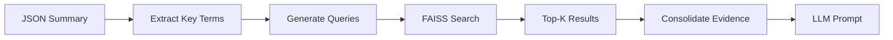

# Step 5: Cover Letter Generation

**RAG-Powered Personalized Cover Letter Creation with Token Tracking**

## Overview

The final step that combines candidate resume data (from Step 2) with supervisor analysis (from Step 4) to generate personalized, professional cover letters. Uses advanced RAG techniques to intelligently retrieve relevant candidate experience and synthesize it with position requirements.

## Usage

### Standalone Execution
```bash
python 05_cover_letter_generation/step5_main.py "outputs/step4/summary_Professor_Name_YYYYMMDD_HHMMSS.json"
```

### As Part of Main Pipeline
```bash
python main_pipeline.py "resume.pdf" "Professor Name" "University" "Publication URL" "position.pdf"
```

## Components

```
05_cover_letter_generation/
├── step5_main.py               # Main entry point with token tracking
├── step5_letter_generator.py   # CoverLetterGenerator orchestration class
├── step5_rag_retriever.py      # CandidateRetriever for FAISS RAG
└── step5_prompts.py            # Creative writing prompt templates
```

## Core Technologies

- **RAG System**: FAISS vector store similarity search
- **LLM Integration**: Azure OpenAI with creative writing prompts
- **Query Generation**: Intelligent extraction from position requirements
- **Evidence Consolidation**: Multi-query result aggregation

## Input Requirements

| Input Source | Description | Format |
|-------------|-------------|--------|
| Step 4 Summary | Structured supervisor analysis | JSON file |
| Candidate Vector Store | Resume embeddings from Step 2 | FAISS directory |

## Processing Workflow

1. **Input Validation**: Verifies JSON summary and vector store availability
2. **Query Extraction**: Generates search queries from position requirements
3. **RAG Retrieval**: Searches candidate vector store for relevant experience
4. **Evidence Consolidation**: Combines multiple search results
5. **Prompt Construction**: Builds creative writing prompt with context
6. **LLM Generation**: Creates personalized cover letter
7. **Token Tracking**: Monitors LLM usage and displays summary

## Token Usage

Step 5 typically consumes:
- **LLM Prompt Tokens**: ~2,239 (summary + evidence + instructions)
- **LLM Completion Tokens**: ~477 (generated cover letter)
- **Total**: ~2,716 tokens (highest consumption in pipeline)

## RAG Query Types

The system generates multiple query types for comprehensive retrieval:

| Query Category | Source | Example |
|---------------|--------|---------|
| **Required Skills** | position_details.required_skills | "Python programming experience" |
| **Preferred Experience** | position_details.preferred_experience | "Machine learning frameworks" |
| **Project Summary** | position_details.project_summary | "Research in climate modeling" |

## RAG Retrieval Process



## Key Features

- **Multi-Query RAG**: Searches multiple aspects of candidate experience
- **Evidence Deduplication**: Removes redundant information
- **Context-Aware Prompting**: Tailors tone and content to position
- **Creative Temperature**: Higher LLM temperature for natural writing
- **Token Optimization**: Efficient prompt construction
- **Error Recovery**: Graceful fallbacks when RAG queries fail

## Technical Configuration

### **RAG Parameters**
- **Top-K Retrieval**: 3 most similar chunks per query
- **Similarity Threshold**: Cosine similarity based
- **Query Diversity**: Multiple complementary search terms
- **Evidence Limit**: Consolidated to prevent prompt overflow

### **LLM Parameters**
- **Model**: Azure OpenAI DevGPT4o
- **Temperature**: 0.7 (creative writing optimized)
- **Max Tokens**: 2000 (full cover letter length)
- **System Role**: Professional writing assistant

## Output Files

Generated in `outputs/step5/`:
- **Format**: `Cover_Letter_for_[Supervisor_Name]_[timestamp].txt`
- **Content**: Professional cover letter ready for submission
- **Length**: Typically 400-600 words
- **Structure**: Standard academic cover letter format

## Cover Letter Structure

1. **Header**: Candidate contact information and date
2. **Addressee**: Professor and university details
3. **Opening**: Clear statement of interest and position
4. **Body Paragraphs**:
   - Relevant experience alignment
   - Technical skills demonstration
   - Research interest connection
5. **Questions**: Thoughtful inquiries about the position
6. **Closing**: Professional sign-off

## Quality Assurance

- **Relevance Scoring**: RAG retrieval quality validation
- **Content Verification**: Ensures factual accuracy from resume
- **Tone Consistency**: Professional academic writing style
- **Length Optimization**: Appropriate length for cover letters
- **Error Detection**: Identifies and handles incomplete information

## Dependencies

| Technology | Purpose | Integration |
|-----------|---------|-------------|
| FAISS | Vector similarity search | CandidateRetriever |
| Azure OpenAI | Creative text generation | CoverLetterGenerator |
| LangChain | Vector store management | Load operations |
| JSON | Structured data parsing | Summary input |

## Performance Characteristics

- **RAG Speed**: ~2-3 seconds for evidence retrieval
- **LLM Generation**: ~8-12 seconds for cover letter
- **Total Time**: ~10-15 seconds end-to-end
- **Memory Usage**: Moderate (vector store in memory)

## Optimization Features

- **Query Caching**: Avoids redundant similarity searches
- **Prompt Efficiency**: Optimized token usage for cost control
- **Batch Processing**: Can handle multiple candidates efficiently
- **Error Resilience**: Continues with partial evidence if needed

## Integration Points

**Inputs**: 
- Step 4 JSON summary (supervisor analysis)
- Step 2 vector store (candidate embeddings)

**Outputs**: 
- Professional cover letter text file
- Token usage summary

**Dependencies**: 
- Azure OpenAI LLM service
- FAISS vector similarity search

## Success Metrics

- **Relevance**: Cover letter aligns with position requirements
- **Personalization**: Incorporates specific candidate experience
- **Professionalism**: Maintains academic writing standards
- **Completeness**: Addresses all key position aspects
- **Engagement**: Includes thoughtful questions for supervisor

**Pipeline Complete - Ready for Academic Application Submission!**
